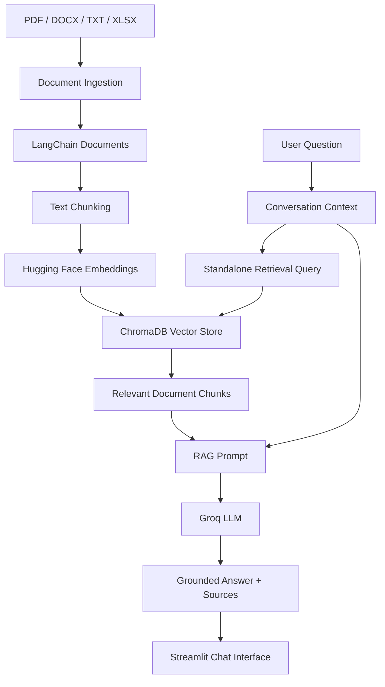

# Multi-Format Conversational RAG Chatbot

A professional Retrieval-Augmented Generation (RAG) chatbot built using **LangChain, ChromaDB, Hugging Face embeddings, Groq LLMs, and Streamlit**.

The application ingests documents in multiple formats, converts them into embeddings, stores them in a persistent ChromaDB vector database, retrieves semantically relevant document chunks, and uses an LLM to generate grounded conversational answers.

The system also maintains visible chat history, supports follow-up questions, displays retrieved sources, and includes automated retrieval evaluation and unit testing.

---

## Features

- Retrieval-Augmented Generation (RAG)
- Large Language Model integration
- LangChain-based orchestration
- ChromaDB vector database
- Local Hugging Face embeddings
- Multi-format document ingestion
  - PDF
  - DOCX
  - TXT
  - XLSX
- Configurable document chunking
- Persistent vector indexing
- Semantic similarity search
- Conversational question answering
- Follow-up question contextualization
- Visible chat history
- Source attribution
- Streamlit user interface
- Retrieval evaluation metrics
- Output visualization
- Automated unit tests
- GitHub Actions CI pipeline
- Object-Oriented Programming architecture

---

## System Architecture



The application consists of two main pipelines:

### Indexing Pipeline

```text
Documents
    ↓
Document Loaders
    ↓
LangChain Documents
    ↓
Text Splitting
    ↓
Embeddings
    ↓
ChromaDB
```

### Query Pipeline

```text
User Question
    ↓
Conversation Contextualization
    ↓
Semantic Retrieval
    ↓
Relevant Document Chunks
    ↓
RAG Prompt
    ↓
LLM
    ↓
Answer + Sources
```

---

## Technologies Used

| Technology | Purpose |
|---|---|
| Python | Core application language |
| LangChain | RAG orchestration and abstractions |
| ChromaDB | Persistent vector database |
| Hugging Face Sentence Transformers | Document and query embeddings |
| all-MiniLM-L6-v2 | Embedding model |
| Groq | LLM inference |
| Llama 3.1 8B Instant | Language model |
| Streamlit | Conversational web interface |
| PyPDF | PDF text extraction |
| python-docx | DOCX processing |
| pandas | Structured data processing |
| openpyxl | Excel processing |
| pytest | Automated testing |
| pytest-cov | Test coverage |
| Matplotlib | Evaluation visualizations |
| GitHub Actions | Continuous Integration |

---

# Dataset

The project uses a purpose-built **synthetic enterprise knowledge base** representing a fictional company named **NexaTech**.

A synthetic dataset was selected because it:

- provides controlled ground truth for evaluation;
- supports all document formats required by the project;
- contains no confidential or proprietary information;
- allows retrieval performance to be measured objectively;
- makes the project completely reproducible.

The dataset can be generated using:

```bash
python scripts/generate_dataset.py
```

## Dataset Files

### `employee_handbook.pdf`

Contains information about:

- annual leave;
- leave carry-forward;
- probation period;
- sickness reporting;
- professional development allowance.

### `remote_work_policy.docx`

Contains information about:

- remote-working allowance;
- remote-working eligibility;
- company equipment;
- VPN requirements;
- international remote working.

### `company_faq.txt`

Contains information about:

- office hours;
- IT support;
- expense claims;
- building access;
- parking;
- employee referral programme.

### `product_catalog.xlsx`

Contains structured information about:

- laptops;
- desktop computers;
- monitors;
- accessories;
- prices;
- warranties;
- stock;
- service centres.

An additional ground-truth evaluation dataset is stored in:

```text
data/evaluation/evaluation_questions.json
```

It contains predefined questions together with their expected answers and expected source documents.

---

# Project Structure

```text
rag-document-chatbot/
│
├── .github/
│   └── workflows/
│       └── ci.yml
│
├── data/
│   ├── raw/
│   │   ├── company_faq.txt
│   │   ├── employee_handbook.pdf
│   │   ├── product_catalog.xlsx
│   │   └── remote_work_policy.docx
│   │
│   └── evaluation/
│       └── evaluation_questions.json
│
├── outputs/
│   ├── retrieval_metrics.json
│   ├── retrieval_performance.png
│   └── experiments/
│
├── scripts/
│   ├── build_index.py
│   ├── check_project.py
│   ├── evaluate_retrieval.py
│   ├── generate_dataset.py
│   ├── test_ingestion.py
│   ├── test_rag.py
│   └── test_search.py
│
├── src/
│   └── rag_chatbot/
│       │
│       ├── config.py
│       │
│       ├── ingestion/
│       │   ├── base_loader.py
│       │   ├── docx_loader.py
│       │   ├── excel_loader.py
│       │   ├── ingestion_service.py
│       │   ├── loader_factory.py
│       │   ├── pdf_loader.py
│       │   └── text_loader.py
│       │
│       ├── processing/
│       │   └── text_splitter.py
│       │
│       ├── embeddings/
│       │   └── embedding_service.py
│       │
│       ├── vectorstore/
│       │   └── chroma_store.py
│       │
│       ├── retrieval/
│       │   └── retriever.py
│       │
│       ├── prompts/
│       │   └── rag_prompt.py
│       │
│       ├── llm/
│       │   └── llm_service.py
│       │
│       └── services/
│           └── chat_service.py
│
├── tests/
│   ├── conftest.py
│   ├── test_document_loaders.py
│   ├── test_ingestion_service.py
│   ├── test_loader_factory.py
│   └── test_text_splitter.py
│
├── .env.example
├── .gitignore
├── app.py
├── pyproject.toml
├── requirements.txt
└── README.md
```

---

# Object-Oriented Design

The project follows a modular OOP architecture.

Document ingestion is implemented using specialized loader classes:

```text
BaseDocumentLoader
        │
        ├── PDFDocumentLoader
        ├── DOCXDocumentLoader
        ├── TextDocumentLoader
        └── ExcelDocumentLoader
```

`DocumentLoaderFactory` selects the appropriate loader depending on the file extension.

Higher-level services separate responsibilities:

```text
DocumentIngestionService
DocumentTextSplitter
EmbeddingService
ChromaVectorStore
DocumentRetriever
LLMService
ChatService
```

This separation improves maintainability, testability, and extensibility.

---

# Installation

## 1. Clone the Repository

```bash
git clone https://github.com/warishasijil/rag-document-chatbot.git
```

Move into the project:

```bash
cd rag-document-chatbot
```

---

# Virtual Environment Setup

Python **3.12** is recommended.

Create the virtual environment:

### Windows

```powershell
py -3.12 -m venv .venv
```

Activate it:

```powershell
.\.venv\Scripts\Activate.ps1
```

### macOS/Linux

```bash
python3.12 -m venv .venv
```

Activate:

```bash
source .venv/bin/activate
```

---

# Install Dependencies

Upgrade pip:

```bash
python -m pip install --upgrade pip
```

Install dependencies:

```bash
pip install -r requirements.txt
```

Install the project in editable mode:

```bash
pip install -e .
```

---

# Environment Variables

Create a `.env` file from the provided example.

### Windows

```powershell
Copy-Item .env.example .env
```

### macOS/Linux

```bash
cp .env.example .env
```

Add your Groq API key:

```text
GROQ_API_KEY=your_groq_api_key_here
```

The `.env` file is excluded from Git and must never be committed.

---

# Generate the Dataset

The included synthetic knowledge base can be regenerated using:

```bash
python scripts/generate_dataset.py
```

This creates the PDF, DOCX, TXT, Excel, and evaluation files used by the application.

---

# Build the Vector Database

Before running the chatbot, build the ChromaDB index:

```bash
python scripts/build_index.py
```

This performs:

```text
Document ingestion
      ↓
Text chunking
      ↓
Embedding generation
      ↓
ChromaDB indexing
```

The local database is stored in:

```text
chroma_db/
```

The database directory is excluded from Git because it can be regenerated from the source documents.

---

# Run the Application

Start the Streamlit application:

```bash
python -m streamlit run app.py
```

The application will provide a local URL, normally:

```text
http://localhost:8501
```

---

# Example Questions

Examples include:

```text
How many days of annual leave do full-time employees receive?
```

```text
How many can they carry forward?
```

```text
Which laptop has a three-year warranty?
```

Followed conversationally by:

```text
How much does it cost?
```

The system rewrites ambiguous follow-up questions into standalone retrieval queries.

For example:

```text
How much does it cost?
```

may become:

```text
laptop price NexaBook Pro
```

before being sent to ChromaDB.

---

# Prompt Engineering

The RAG prompt instructs the LLM to:

- answer only from retrieved document context;
- avoid using external knowledge for NexaTech facts;
- avoid inventing policies, prices, people, or sources;
- admit when sufficient information is unavailable;
- use conversation history only for understanding references;
- associate answers with retrieved source labels.

A separate contextualization prompt converts conversational follow-up questions into standalone retrieval queries.

---

# Chunking Optimization

Initial retrieval used:

```text
Chunk size:    800
Chunk overlap: 150
```

Evaluation revealed that the large chunks caused unrelated FAQ topics to share a single embedding.

Two queries retrieved the correct document at rank 2 rather than rank 1.

The configuration was therefore changed to:

```text
Chunk size:    300
Chunk overlap: 50
```

This improved retrieval specificity.

---

# Retrieval Evaluation

Retrieval was evaluated using **14 ground-truth questions**.

The following metrics were calculated:

- Hit Rate@1
- Hit Rate@3
- Hit Rate@5
- Mean Reciprocal Rank (MRR)
- Average retrieval latency

## Baseline Results

Configuration:

```text
chunk_size = 800
chunk_overlap = 150
```

Results:

| Metric | Result |
|---|---:|
| Hit Rate@1 | 85.71% |
| Hit Rate@3 | 100.00% |
| Hit Rate@5 | 100.00% |
| MRR | 0.9286 |
| Average retrieval latency | 31.68 ms |

Error analysis identified two source-ranking failures involving the multi-topic company FAQ.

---

## Optimized Results

Configuration:

```text
chunk_size = 300
chunk_overlap = 50
```

Results:

| Metric | Result |
|---|---:|
| Hit Rate@1 | **100.00%** |
| Hit Rate@3 | **100.00%** |
| Hit Rate@5 | **100.00%** |
| MRR | **1.0000** |
| Average retrieval latency | **20.11 ms** |

The optimized configuration is used by the final system.

The retrieval performance visualization is stored at:

```text
outputs/retrieval_performance.png
```

The detailed metrics are stored at:

```text
outputs/retrieval_metrics.json
```

### Evaluation Limitation

The evaluation dataset contains 14 synthetic ground-truth questions and primarily evaluates retrieval at the expected-source level.

Therefore, the reported 100% retrieval result should be interpreted as performance on this controlled test set rather than evidence of universal RAG accuracy.

---

# End-to-End RAG Evaluation

In addition to evaluating vector retrieval, the complete RAG pipeline was evaluated using the same controlled set of 14 ground-truth questions.

The end-to-end evaluation tested:

- retrieval of relevant document context;
- final LLM answer correctness;
- expected-source attribution;
- total RAG response latency.

The evaluation was executed using:

```bash
python scripts/evaluate_rag.py
```

## Results

| Metric | Result |
|---|---:|
| Answer Accuracy | **100.00%** |
| Source Attribution Accuracy | **100.00%** |
| Average RAG Latency | **767.88 ms** |
| Median RAG Latency | **167.65 ms** |

On the controlled 14-question synthetic evaluation set, every generated response contained the expected reference answer and every response included the expected source document.

The detailed evaluation results are stored in:

```text
outputs/rag_evaluation_metrics.json
```

The answer-quality visualization is stored in:

```text
outputs/rag_answer_evaluation.png
```

## Latency Analysis

The median end-to-end latency was **167.65 ms**, while the mean was considerably higher at **767.88 ms**.

Most evaluated requests completed in approximately **124–191 ms**, with one request taking approximately **508 ms**. Two requests were substantial outliers at approximately **4.24 seconds** each.

These outliers increased the arithmetic mean significantly, making the median a more representative measure of typical response latency for this evaluation run.

Vector retrieval itself remained considerably faster, averaging approximately **20.11 ms**. The end-to-end latency additionally includes prompt construction and communication with the externally hosted LLM.

Because the LLM is accessed through an external API, response latency may vary because of network conditions and provider-side inference time.

## Evaluation Methodology

Reference answers and expected source documents were defined in:

```text
data/evaluation/evaluation_questions.json
```

Generated answers were normalized before comparison so that formatting differences did not incorrectly count as failures.

For example:

```text
Expected:
£1299

Generated:
The NexaBook Pro costs £1,299.
```

is treated as a correct answer.

The evaluator also verifies that the expected source document occurs in the sources returned by the RAG pipeline.

## Evaluation Limitations

The reported results should be interpreted within the scope of the evaluation dataset.

The evaluation currently uses:

- 14 synthetic questions;
- a controlled synthetic enterprise knowledge base;
- deterministic reference-answer matching;
- expected-source attribution;
- a single primary embedding configuration;
- a single LLM configuration.

Therefore, the reported **100% answer accuracy does not imply universal chatbot accuracy**.

Future evaluation could include:

- a substantially larger test dataset;
- paraphrased and adversarial questions;
- unanswerable questions;
- chunk-level ground truth;
- semantic answer evaluation;
- LLM-as-a-judge evaluation;
- hallucination-rate measurement;
- repeated latency benchmarking;
- evaluation across multiple embedding and LLM models.

# Automated Testing

The project contains automated unit tests covering:

- TXT ingestion;
- PDF ingestion;
- DOCX ingestion;
- Excel ingestion;
- metadata preservation;
- loader factory selection;
- unsupported file handling;
- ingestion service behaviour;
- empty directories;
- missing directories;
- document chunking;
- metadata preservation during chunking.

Run:

```bash
python -m pytest -v
```

Current result:

```text
16 passed
```

Test coverage can be inspected using:

```bash
python -m pytest --cov=rag_chatbot --cov-report=term-missing
```

---

# Continuous Integration

A GitHub Actions workflow is configured at:

```text
.github/workflows/ci.yml
```

The CI pipeline automatically runs on:

- pushes to `main`;
- pull requests targeting `main`.

The workflow:

```text
Checkout repository
      ↓
Set up Python 3.12
      ↓
Install dependencies
      ↓
Install project
      ↓
Run pytest
      ↓
Run coverage
```

This provides automated validation of the codebase before changes are integrated.

---

# Trained Models

No model is trained from scratch in this project.

The system uses pretrained models:

- `sentence-transformers/all-MiniLM-L6-v2` for embeddings;
- `llama-3.1-8b-instant` through Groq for language generation.

The project focuses on **Retrieval-Augmented Generation**, where pretrained models are augmented with application-specific knowledge retrieved from ChromaDB.

Therefore, a separately trained model artifact is **not applicable** to this project.

---

# Security

Sensitive credentials are stored in:

```text
.env
```

and excluded from Git using `.gitignore`.

The repository only contains:

```text
.env.example
```

which documents the required environment-variable names without exposing credentials.

---

# Future Improvements

Possible improvements include:

- larger and more diverse evaluation datasets;
- chunk-level ground-truth evaluation;
- LLM answer-quality evaluation;
- retrieval similarity thresholds;
- reranking;
- hybrid semantic and keyword retrieval;
- document upload directly from the Streamlit interface;
- persistent user conversations;
- containerization with Docker;
- deployment to a cloud platform.

---

# Conclusion

This project demonstrates an end-to-end implementation of a professional multi-format conversational RAG system.

It integrates:

- document ingestion;
- text preprocessing;
- embeddings;
- vector indexing;
- semantic retrieval;
- prompt engineering;
- conversational context;
- LLM generation;
- source attribution;
- automated evaluation;
- software testing;
- continuous integration;
- and a user-facing chat interface.

The final system provides a modular and extensible foundation for document-based AI assistants.