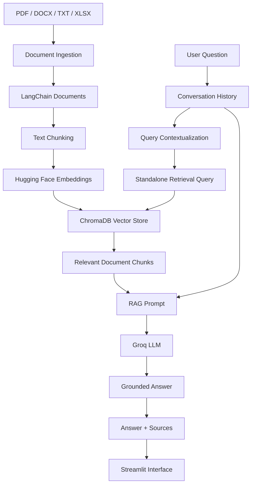

# Multi-Format Conversational RAG Chatbot

A modular Retrieval-Augmented Generation (RAG) chatbot built with **LangChain, ChromaDB, Hugging Face embeddings, Groq, and Streamlit**.

The application can ingest multiple document formats, create vector embeddings, store them in a persistent ChromaDB database, retrieve semantically relevant information, and generate grounded conversational answers using an LLM.

The chatbot also supports follow-up questions, visible chat history, source attribution, automated retrieval evaluation, end-to-end RAG evaluation, unit testing, and continuous integration.

---

## Features

* Retrieval-Augmented Generation (RAG)
* Multi-format document ingestion

  * PDF
  * DOCX
  * TXT
  * XLSX
* LangChain-based orchestration
* Hugging Face sentence-transformer embeddings
* Persistent ChromaDB vector store
* Semantic similarity search
* Conversational question answering
* Follow-up question contextualization
* Visible chat history
* Source attribution
* Hallucination-aware prompting
* Streamlit web interface
* Retrieval evaluation
* End-to-end answer evaluation
* Performance visualization
* Automated unit tests
* GitHub Actions CI
* Modular Object-Oriented architecture

---

# System Architecture



The project contains two main pipelines.

## Indexing Pipeline

```text
Documents
    ↓
Document Loaders
    ↓
LangChain Documents
    ↓
Text Chunking
    ↓
Embeddings
    ↓
ChromaDB
```

## Query Pipeline

```text
User Question
    ↓
Conversation Contextualization
    ↓
Standalone Retrieval Query
    ↓
Semantic Retrieval
    ↓
Relevant Context
    ↓
RAG Prompt
    ↓
LLM
    ↓
Answer + Sources
```

---

# Technologies Used

| Technology                               | Purpose                                     |
| ---------------------------------------- | ------------------------------------------- |
| Python 3.12                              | Core programming language                   |
| LangChain                                | RAG orchestration and document abstractions |
| ChromaDB                                 | Persistent vector database                  |
| Hugging Face                             | Embedding model integration                 |
| `sentence-transformers/all-MiniLM-L6-v2` | Text embeddings                             |
| Groq                                     | Hosted LLM inference                        |
| `openai/gpt-oss-20b`                     | Language generation                         |
| Streamlit                                | Conversational user interface               |
| PyPDF                                    | PDF text extraction                         |
| python-docx                              | DOCX processing                             |
| pandas                                   | Structured data processing                  |
| openpyxl                                 | Excel processing                            |
| Matplotlib                               | Evaluation visualizations                   |
| pytest                                   | Automated testing                           |
| pytest-cov                               | Test coverage                               |
| GitHub Actions                           | Continuous Integration                      |

---

# Dataset

The project uses a purpose-built **synthetic enterprise knowledge base** for a fictional company named **NexaTech**.

A synthetic dataset was used because it provides:

* controlled ground truth for evaluation;
* coverage of all required document formats;
* reproducible experiments;
* no confidential or proprietary information;
* clearly defined expected answers and source documents.

The dataset can be regenerated using:

```bash
python scripts/generate_dataset.py
```

---

## Dataset Files

### `employee_handbook.pdf`

Contains information about:

* annual leave entitlement;
* leave carry-forward;
* probation period;
* sickness reporting;
* professional development allowance.

### `remote_work_policy.docx`

Contains information about:

* remote-working allowance;
* remote-working eligibility;
* VPN requirements;
* company equipment;
* international remote working.

### `company_faq.txt`

Contains information about:

* office hours;
* IT support;
* business expenses;
* office access;
* parking;
* employee referral bonus.

### `product_catalog.xlsx`

Contains structured information about:

* laptops;
* desktop computers;
* monitors;
* accessories;
* product prices;
* warranties;
* stock;
* service centres.

---

## Evaluation Dataset

Ground-truth evaluation questions are stored in:

```text
data/evaluation/evaluation_questions.json
```

Each item contains:

```text
Question
Expected answer
Expected source document
```

The current evaluation dataset contains **14 questions** covering all four document formats.

---

# Project Structure

```text
rag-document-chatbot/
│
├── .github/
│   └── workflows/
│       └── ci.yml
│
├── data/
│   ├── raw/
│   │   ├── company_faq.txt
│   │   ├── employee_handbook.pdf
│   │   ├── product_catalog.xlsx
│   │   └── remote_work_policy.docx
│   │
│   └── evaluation/
│       └── evaluation_questions.json
│
├── outputs/
│   ├── experiments/
│   ├── rag_answer_evaluation.png
│   ├── rag_evaluation_metrics.json
│   ├── retrieval_metrics.json
│   └── retrieval_performance.png
│
├── scripts/
│   ├── build_index.py
│   ├── check_project.py
│   ├── evaluate_rag.py
│   ├── evaluate_retrieval.py
│   ├── generate_dataset.py
│   ├── test_ingestion.py
│   ├── test_rag.py
│   └── test_search.py
│
├── src/
│   └── rag_chatbot/
│       │
│       ├── config.py
│       │
│       ├── ingestion/
│       │   ├── base_loader.py
│       │   ├── docx_loader.py
│       │   ├── excel_loader.py
│       │   ├── ingestion_service.py
│       │   ├── loader_factory.py
│       │   ├── pdf_loader.py
│       │   └── text_loader.py
│       │
│       ├── processing/
│       │   └── text_splitter.py
│       │
│       ├── embeddings/
│       │   └── embedding_service.py
│       │
│       ├── vectorstore/
│       │   └── chroma_store.py
│       │
│       ├── retrieval/
│       │   └── retriever.py
│       │
│       ├── prompts/
│       │   └── rag_prompt.py
│       │
│       ├── llm/
│       │   └── llm_service.py
│       │
│       └── services/
│           └── chat_service.py
│
├── tests/
│   ├── conftest.py
│   ├── test_document_loaders.py
│   ├── test_ingestion_service.py
│   ├── test_loader_factory.py
│   └── test_text_splitter.py
│
├── .env.example
├── .gitignore
├── app.py
├── pyproject.toml
├── requirements.txt
└── README.md
```

---

# Object-Oriented Design

The project follows a modular Object-Oriented structure.

Document ingestion is built around a common loader interface:

```text
BaseDocumentLoader
        │
        ├── PDFDocumentLoader
        ├── DOCXDocumentLoader
        ├── TextDocumentLoader
        └── ExcelDocumentLoader
```

`DocumentLoaderFactory` selects the correct loader depending on the file extension.

The main responsibilities are separated into dedicated services:

```text
DocumentIngestionService
DocumentTextSplitter
EmbeddingService
ChromaVectorStore
DocumentRetriever
LLMService
ChatService
```

This keeps document loading, embedding, retrieval, language-model interaction, and conversational logic separate and easier to maintain and test.

---

# Installation

## 1. Clone the Repository

```bash
git clone https://github.com/warishasijil/rag-document-chatbot.git
```

Move into the project directory:

```bash
cd rag-document-chatbot
```

---

# Virtual Environment Setup

Python **3.12** is recommended.

## Windows

Create a virtual environment:

```powershell
py -3.12 -m venv .venv
```

Activate it:

```powershell
.\.venv\Scripts\Activate.ps1
```

If PowerShell prevents activation for the current session:

```powershell
Set-ExecutionPolicy -Scope Process -ExecutionPolicy RemoteSigned
```

Then activate the environment again.

## macOS / Linux

```bash
python3.12 -m venv .venv
```

Activate:

```bash
source .venv/bin/activate
```

---

# Install Dependencies

Upgrade pip:

```bash
python -m pip install --upgrade pip
```

Install the required packages:

```bash
pip install -r requirements.txt
```

Install the project in editable mode:

```bash
pip install -e .
```

---

# Environment Variables

Create a `.env` file from the included example.

## Windows

```powershell
Copy-Item .env.example .env
```

## macOS / Linux

```bash
cp .env.example .env
```

Add a Groq API key:

```text
GROQ_API_KEY=your_groq_api_key_here
```

The `.env` file is excluded from version control.

---

# Generate the Dataset

The included synthetic NexaTech dataset can be regenerated using:

```bash
python scripts/generate_dataset.py
```

This generates the PDF, DOCX, TXT, XLSX, and evaluation data used by the project.

---

# Document Ingestion

Each supported format has its own loader.

The ingestion service converts the source files into LangChain `Document` objects while preserving useful metadata.

Example metadata includes:

```text
file_name
file_type
page
sheet
row
source
```

Excel rows are stored as individual documents.

For example:

```text
Product: NexaBook Pro
Category: Laptop
Price_GBP: 1299
Warranty_Years: 3
Stock: 22
```

This allows individual spreadsheet records to be retrieved semantically.

---

# Text Chunking

Documents are split using LangChain's `RecursiveCharacterTextSplitter`.

The final configuration is:

```text
Chunk size:    300
Chunk overlap: 50
```

The splitter also records the starting character position of each chunk in its metadata.

---

# Embeddings

The system uses:

```text
sentence-transformers/all-MiniLM-L6-v2
```

through Hugging Face.

Embeddings are normalized before being stored and queried.

---

# Vector Database

ChromaDB is used as the persistent vector store.

The database is stored locally in:

```text
chroma_db/
```

The directory is intentionally excluded from Git because the index can be reproduced from the source documents.

---

# Build the Vector Index

Before running the chatbot, create the ChromaDB index:

```bash
python scripts/build_index.py
```

The script:

```text
Loads documents
      ↓
Splits documents into chunks
      ↓
Creates embeddings
      ↓
Builds the ChromaDB index
```

The existing index is removed before rebuilding to prevent duplicate records.

---

# Conversational Retrieval

The chatbot supports follow-up questions.

For example:

```text
User:
Which laptop has a three-year warranty?

Assistant:
The NexaBook Pro.
```

The next question may be:

```text
User:
How much does it cost?
```

Before retrieval, the contextualization model converts this into a standalone query such as:

```text
How much does the NexaBook Pro cost?
```

This allows the retriever to correctly understand conversational references.

The contextualization prompt is instructed not to invent extra dates, locations, policies, or other facts that were not present in the conversation.

---

# Prompt Engineering

The final RAG prompt instructs the model to:

* answer using retrieved context;
* avoid inventing company facts;
* avoid inventing prices, policies, people, dates, or sources;
* use conversation history only to resolve conversational context;
* associate factual answers with retrieved sources;
* explicitly state when the indexed documents do not contain the requested information.

For unsupported questions, the expected response is:

```text
I couldn't find that information in the indexed documents.
```

This behaviour reduces unsupported generation and makes failures visible to the user.

---

# Run the Application

Start the Streamlit interface using:

```bash
python -m streamlit run app.py
```

Streamlit will provide a local application URL, typically:

```text
http://localhost:8501
```

---

# Streamlit Interface

The user interface provides:

* conversational chat;
* visible conversation history;
* retrieved source information;
* retrieval-query inspection;
* configuration details;
* a clear-conversation control.

When the RAG system explicitly reports that the answer was not found, unrelated retrieved chunks are not shown as supporting sources.

---

# Example Questions

```text
How many days of annual leave do full-time employees receive?
```

```text
How many can they carry forward?
```

```text
Which laptop has a three-year warranty?
```

```text
How much does it cost?
```

```text
Which service centre offers drop-off-only support?
```

An example unanswerable question is:

```text
Who is the CEO of NexaTech?
```

Because the CEO is not included in the indexed documents, the chatbot should decline to invent an answer.

---

# Retrieval Evaluation

Retrieval performance is evaluated using:

```bash
python scripts/evaluate_retrieval.py
```

The evaluator uses the 14 ground-truth questions stored in:

```text
data/evaluation/evaluation_questions.json
```

For each question, the expected document is compared against the ranked documents returned by ChromaDB.

The following metrics are calculated:

* Hit Rate@1
* Hit Rate@3
* Hit Rate@5
* Mean Reciprocal Rank
* retrieval latency

---

## Baseline Retrieval Configuration

The initial configuration used:

```text
chunk_size = 800
chunk_overlap = 150
```

Results:

| Metric                    |   Result |
| ------------------------- | -------: |
| Hit Rate@1                |   85.71% |
| Hit Rate@3                |  100.00% |
| Hit Rate@5                |  100.00% |
| MRR                       |   0.9286 |
| Average Retrieval Latency | 31.68 ms |

Error analysis showed that two FAQ questions retrieved the correct source at rank 2 rather than rank 1.

The larger chunks caused several unrelated FAQ topics to share a single embedding representation.

---

## Optimized Retrieval Configuration

The chunking configuration was changed to:

```text
chunk_size = 300
chunk_overlap = 50
```

The optimized evaluation achieved:

| Metric     |      Result |
| ---------- | ----------: |
| Hit Rate@1 | **100.00%** |
| Hit Rate@3 | **100.00%** |
| Hit Rate@5 | **100.00%** |
| MRR        |  **1.0000** |

The optimized run demonstrated that all 14 expected source documents were ranked first for their corresponding evaluation questions.

Retrieval latency is stored with each evaluation run in:

```text
outputs/retrieval_metrics.json
```

The performance visualization is stored in:

```text
outputs/retrieval_performance.png
```

Because latency can vary between runs, the JSON output should be treated as the authoritative value for the most recent benchmark.

---

# End-to-End RAG Evaluation

Retrieval quality alone does not confirm that the final generated answer is correct.

The complete question-answering pipeline is therefore evaluated separately using:

```bash
python scripts/evaluate_rag.py
```

The evaluation measures:

* generated answer correctness;
* expected-source attribution;
* complete RAG response latency.

---

## Final End-to-End Results

The final system uses:

```text
LLM: openai/gpt-oss-20b
Embedding model: sentence-transformers/all-MiniLM-L6-v2
Chunk size: 300
Chunk overlap: 50
Retrieval K: 4
```

Results on the controlled 14-question evaluation set:

| Metric                      |        Result |
| --------------------------- | ------------: |
| Questions Evaluated         |        **14** |
| Answer Accuracy             |   **100.00%** |
| Source Attribution Accuracy |   **100.00%** |
| Average RAG Latency         | **981.61 ms** |
| Median RAG Latency          | **760.36 ms** |

All 14 generated responses contained the expected reference answer, and all 14 responses returned the expected source document.

Detailed results are stored in:

```text
outputs/rag_evaluation_metrics.json
```

The answer-quality visualization is stored in:

```text
outputs/rag_answer_evaluation.png
```

---

# Latency Analysis

The complete RAG pipeline achieved:

```text
Average latency: 981.61 ms
Median latency:  760.36 ms
```

These measurements include:

```text
Query processing
      +
Vector retrieval
      +
Prompt construction
      +
External LLM inference
      +
Response generation
```

This should be distinguished from retrieval-only latency, which does not include LLM inference.

Because the language model is accessed through the externally hosted Groq API, end-to-end latency can vary between evaluation runs depending on factors such as network conditions and provider-side inference time.

---

# Answer Evaluation Methodology

Generated answers are compared against reference answers defined in the evaluation dataset.

Text is normalized before comparison so that formatting differences do not incorrectly count as failures.

For example:

```text
Expected:
£1299
```

and:

```text
Generated:
The NexaBook Pro costs £1,299.
```

are treated as equivalent.

For longer answers, reference-token coverage is calculated.

A reference coverage score of at least:

```text
0.80
```

is treated as a correct answer.

The evaluator separately checks whether the expected source document is included in the retrieved source list.

---

# Evaluation Limitations

The evaluation results should be interpreted within the scope of the test environment.

The current benchmark contains:

* 14 questions;
* a synthetic enterprise knowledge base;
* controlled reference answers;
* expected-source matching;
* deterministic answer normalization;
* one embedding model;
* one final LLM configuration.

Therefore:

> **100% accuracy on this evaluation set does not mean the chatbot is universally 100% accurate.**

The result means that the final system answered all questions correctly within this specific controlled benchmark.

Potential future evaluation improvements include:

* larger evaluation datasets;
* human-written test questions;
* paraphrased queries;
* ambiguous queries;
* adversarial questions;
* larger sets of unanswerable questions;
* chunk-level relevance labels;
* semantic answer evaluation;
* hallucination-rate measurement;
* LLM-as-a-judge evaluation;
* repeated latency benchmarking;
* comparison between different embedding models;
* comparison between different LLMs.

---

# Automated Testing

The project contains automated unit tests covering:

* TXT loading;
* PDF loading;
* DOCX loading;
* Excel loading;
* document metadata;
* loader factory selection;
* unsupported formats;
* ingestion service behaviour;
* missing directories;
* empty directories;
* text splitting;
* metadata preservation after chunking.

Run the test suite using:

```bash
python -m pytest
```

Current result:

```text
16 passed
```

For coverage:

```bash
python -m pytest --cov=rag_chatbot --cov-report=term-missing
```

---

# End-to-End Testing

A separate script tests the live RAG pipeline:

```bash
python scripts/test_rag.py
```

It covers:

```text
Standard document question
        ↓
Conversational follow-up
        ↓
Excel retrieval
        ↓
Excel follow-up
        ↓
Unanswerable question
```

Example tested conversation:

```text
Which laptop has a three-year warranty?
```

followed by:

```text
How much does it cost?
```

The contextualization layer correctly resolves the second question to the NexaBook Pro.

The script also verifies that unsupported information such as the fictional company's CEO is not invented.

---

# Continuous Integration

The project includes a GitHub Actions workflow:

```text
.github/workflows/ci.yml
```

The workflow runs automatically on:

* pushes to `main`;
* pull requests targeting `main`.

The CI pipeline performs:

```text
Checkout repository
      ↓
Set up Python 3.12
      ↓
Install dependencies
      ↓
Install project
      ↓
Run tests with coverage
```

The workflow ensures that changes are automatically tested before integration.

---

# Trained Models

No machine-learning model is trained from scratch in this project.

The RAG system uses pretrained models:

```text
sentence-transformers/all-MiniLM-L6-v2
```

for embeddings, and:

```text
openai/gpt-oss-20b
```

through Groq for language generation.

The project focuses on augmenting a pretrained language model with knowledge retrieved from a vector database rather than training a new model.

Therefore, a custom trained-model artifact is not applicable.

---

# Security

Sensitive credentials are stored locally in:

```text
.env
```

The file is excluded using `.gitignore`.

The repository contains only:

```text
.env.example
```

which documents the required environment-variable names without exposing credentials.

The following are also excluded from version control:

```text
.venv/
chroma_db/
__pycache__/
.pytest_cache/
.coverage
```

---

# Output Files

The project includes reproducible evaluation results and visualizations.

```text
outputs/
├── rag_answer_evaluation.png
├── rag_evaluation_metrics.json
├── retrieval_metrics.json
└── retrieval_performance.png
```

These files provide evidence of both retrieval performance and final RAG answer performance.

---

# Reproducing the Project

A complete run can be reproduced using:

```bash
python scripts/generate_dataset.py
python scripts/build_index.py
python scripts/evaluate_retrieval.py
python scripts/evaluate_rag.py
python -m pytest
python -m streamlit run app.py
```

---

# Future Improvements

Potential improvements include:

* document uploads directly from the interface;
* drag-and-drop ingestion;
* automatic index rebuilding;
* similarity-score thresholds;
* metadata filtering;
* hybrid keyword and semantic retrieval;
* reranking;
* persistent user conversations;
* larger real-world datasets;
* authentication;
* Docker containerization;
* cloud deployment;
* model comparison experiments;
* expanded automated integration tests.

---

# Conclusion

This project demonstrates the development of an end-to-end **multi-format conversational Retrieval-Augmented Generation system**.

The final application integrates:

* PDF, DOCX, TXT, and XLSX ingestion;
* document preprocessing;
* text chunking;
* Hugging Face embeddings;
* ChromaDB vector indexing;
* semantic retrieval;
* conversational query contextualization;
* prompt engineering;
* Groq-based LLM inference;
* grounded answer generation;
* source attribution;
* visible chat history;
* retrieval evaluation;
* end-to-end answer evaluation;
* performance visualization;
* automated testing;
* and continuous integration.

The project provides a reproducible and extensible foundation for document-based AI assistants.
